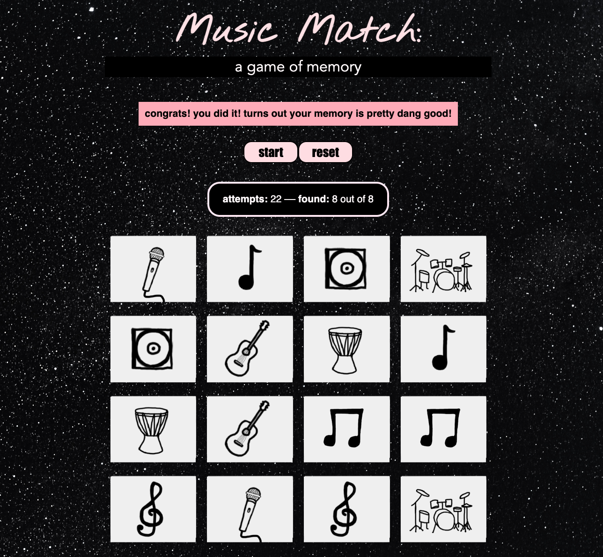

# Music Match Game

Music Match™ is a game that puts your memory to the test! Modeled after a "concentration" card matching game, players must turn over pairs of cards that feature pictures of different music-related paraphernalia (instruments, CDs, etc.)

Inspired by its creators love for all things music, the game is a musical spin on the classic game, featuring hand-sketched cards.

During their turn, a player must select from two of 16 blank cards in hopes of turning up a match. 

If the cards result in a match, the matching cards will remain turned over until the game ends; if there is no match, the cards will be turned back over and a new turn will begin. 

Gameplay continues until players match all of the cards. Upon starting the game, all cards are shuffled and their location is determined randomly.

## Game Play

## Technologies Used

JavaScript, HTML, CSS

## Getting Started

To play the game and start matching you can click [here](https://srbrry.github.io/concentration-memory-game/)

1. Press the start button and click a card to start the game.
2. Find the match by clicking another card.
3. Once you have clicked and found all the matches, you've won.
4. After all matches are found, press the reset button to clear the game board and start a new game.

## Next Steps

Version 2.0

9. As a user, I want my game to be timed.
10. As a user, I want to impose a time limit.
11. As a user, I want to be able to select from two different themed games.

Version 3.0

12. As a user, I want to be able to share on social media my win and the amount of time I completed the game in.
13. As a user, I want the placement of the cards to be random every time.
14. As a user, I want the option to have the computer as my teammate, selecting cards after me.
15. As a user, I want to be able to have built-in music during gameplay.