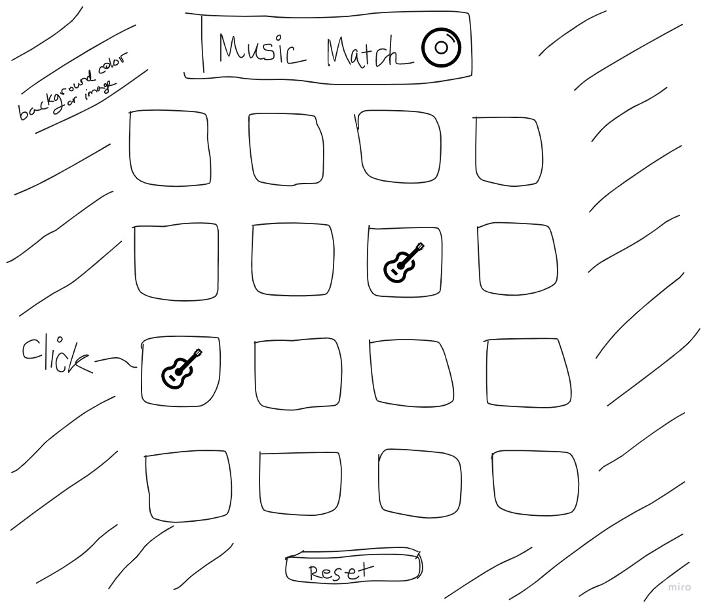

# Music Match Game

Music Match™ is a game that puts your memory to the test! Modeled after a "concentration" memory game, players must turn over pairs of cards that feature pictures of different music-related paraphernalia (instruments, CDs, etc.)

During their turn, a player must select from two of 16 blank cards in hopes of turning up a match. 

If the cards result in a match, the matching cards will remain turned over until the game ends; if there is no match, the cards will be turned back over and a new turn will begin. 

Gameplay continues until players match all of the cards.

## Game Planning

MVP

1. As a user, I want to be able to start and stop the game.
2. As a user I want to be able to shuffle the cards before each game so that the placement is random.
3. As a user, I want to be able to select from 16 blank cards on the screen.
4. As a user, I want to find pairs of music-related images.
5. As a user, I want the cards to turn back over if a match is not found.
6. As a user, I want the cards to remain turned over when I find a match.
7. As a user, I want the game to reset once all matches are found.
8. As a user, I want to be notified when all matches are found and I have won.

Version 2.0

9. As a user, I want my game to be timed.
10. As a user, I want to impose a time limit.
11. As a user, I want to be able to select from two different themed games.

Version 3.0

12. As a user, I want to be able to share on social media my win and the amount of time I completed the game in.
13. As a user, I want the placement of the cards to be random every time.
14. As a user, I want the option to have the computer as my teammate, selecting cards after me.
15. As a user, I want to be able to have built-in music during gameplay.

### _Pseudocode_

1. If 'start' button is clicked
    shuffle card images using some paradigm like Fisher-Yates

   If 'stop' button is clicked
    reset gameplay interface

2. If any picture in the array is clicked, reveal the image underneath

3. If picture1 and picture2 do not match
    return images to blank state

4. If two pictures are clicked and match, 
    leave the picture turned over

5. Once images are all matched
    alert() user "Music Matches found. Congrats!" once all matches are found and user wins

